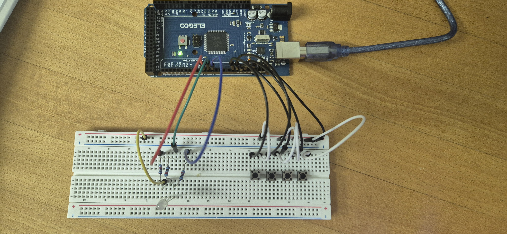

# Anki Controller Projekt

Vier Taster lösen auf einer RGB-LED jeweils einen kurzen Farbblitz (200 ms) aus, jeder Taster hat eine fest zugeordnete Farbe. Vorstufe zu einem geplanten physischen Anki-Antwort-Controller.

**Pins:**

| Bauteil | Pin |
|---|---|
| Taster 1 (Hellblau) | 9 |
| Taster 2 (Grün) | 10 |
| Taster 3 (Gelb) | 11 |
| Taster 4 (Rot) | 12 |
| RGB Rot | 2 |
| RGB Grün | 3 |
| RGB Blau | 4 |

Jeder Tastendruck löst per Edge-Detection genau **einen** Blitz aus, kein Dauerleuchten beim Halten. Ein kurzes `delay(20)` am Ende von `loop()` fängt das Kontaktprellen beim Loslassen ab, sonst zündet der Blitz manchmal doppelt.

**Nächster Schritt:** Ausbau zum echten Anki-Answer-Clicker, der MEGA hat kein natives USB-HID, dafür braucht's eine Python-Bridge zu AnkiConnect.

